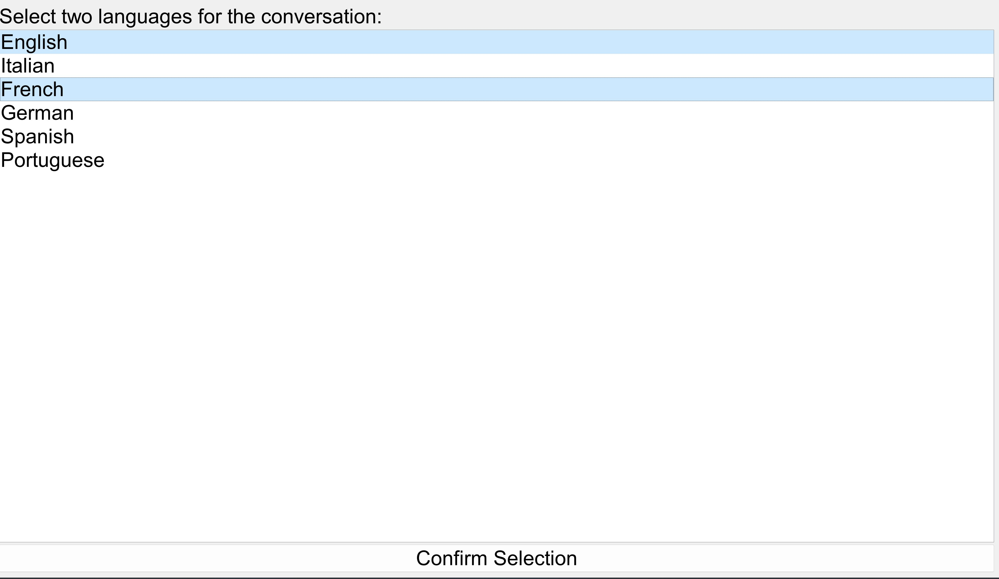
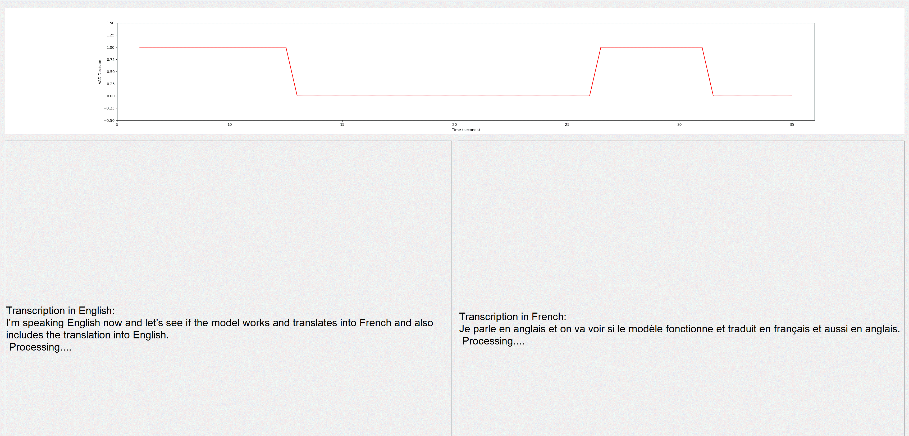

# Simultaneous Real-Time Translation Application

## Description
This application provides real-time translation for conversations between two languages. It is designed to capture speech through a microphone, perform voice activity detection (VAD), and then translate the speech to the selected language. The transcript of the conversation in both languages is displayed on the screen. This application is built using PyQt5 for the GUI, PyAudio for microphone data handling, and the SeamlessM4T model from Meta for the translation tasks.

## Features
- Real-time speech translation.
- Support for multiple language pairs.
- Interactive GUI built with PyQt5.
- Voice Activity Detection to improve translation accuracy.
- Displays a transcript of the conversation in both the original and translated languages.

## Example Images
### Language Select


### Translation


## Installation (Tested on Windows 11)

To run the application, you need to have conda installed on your system.

### Dependencies

Install the required dependencies by running the following command:

```bash
conda env create --name translation
conda activate translation
conda install python=3.10.3
pip install git+https://github.com/huggingface/transformers
pip install PyAudio-0.2.11-cp310-cp310-win_amd64.whl
pip install -r requirements.txt
```

*Note: You may need additional dependencies for SeamlessM4T as per their documentation.*

### Running the Application

Clone the repository to your local machine:

```powershell
git clone https://github.com/nickpolvani/translation.git
cd translation
```

Run the application (These commands are for Powershell, but it's easy to translate them to other terminals):

```powershell
$env:PYTHONPATH = "C:\path\to\this\project\translation\src"
python src\gui\main_gui.py
```

## Usage

1. Start the application.
2. Select the two languages for the conversation from the drop-down menus.
3. Begin speaking into the microphone, and the application will display the translated text in real-time.
4. The transcript of the conversation will be displayed in both selected languages.

## Contributing

Contributions to the project are welcome. Please follow the standard fork, branch, and pull request workflow.
